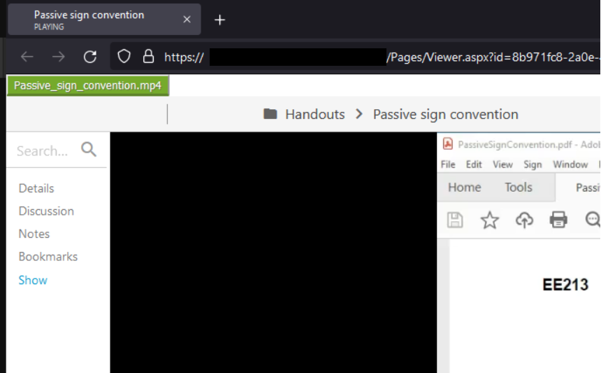

# Lecture Downloader

> Browser extension (Firefox & Chrome) that adds a download button for lecture videos

For this screen recording platform for schools, teachers will use it to record and host their lectures.
This open-source, cross-browser extension adds a direct download button to any video, so students can download lectures for archive or faster playback purposes.

## Example

## Developers
Go to [Development Documentation](DEVELOPMENT.md)
